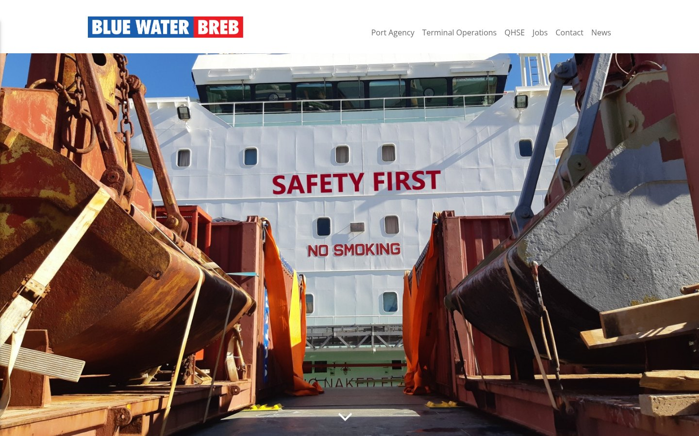

# Blue Water BREB Theme

WinterCMS theme for [Blue Water BREB GmbH](https://bluewaterbreb.de/) — terminal operations and
port agency in Sassnitz. Built by [Art+Code Studio](https://artandcode.studio/).



> **This is not the breb.de theme.** Both are installed as `themes/breb-barba/`, but the content
> comes from two separate repositories that have diverged;
> [breb-october-theme](https://github.com/ArtCodeStudio/breb-october-theme) is the sibling.
> Only the directory name is shared — WinterCMS records the active theme by directory, so this
> theme has to be installed as `themes/breb-barba/`.

## Build

The stylesheet is **built, not compiled by the CMS**. `partials/html_head.htm` links the committed
`assets/css/theme.css`; nothing links `assets/scss/theme.scss` any more. WinterCMS compiles SCSS
with scssphp, and that compiler drops the second selector of a group: `_homepage.scss` opens with
`#home, #bluewaterbreb { … }`, and the compiled stylesheet carried 26 `#home` selectors and not a
single `#bluewaterbreb` one. Since this site's container has `id="bluewaterbreb"`, none of the
homepage rules applied — the two service icons rendered at 569 × 593 px because
`#overview .card img{max-width:150px}` never matched.

```bash
npm install     # dart-sass 1.44.0
npm run build   # assets/scss/theme.scss -> assets/css/theme.css
```

**Rebuild and commit `assets/css/theme.css` after every SCSS change.** Nothing fails if you
forget — the site simply keeps serving the previous stylesheet.

Two prerequisites are not in this repository:

- **The bower vendor tree** under `assets/vendor/`. `bower install` fetches it; `.gitignore`
  keeps it out.
- **A WinterCMS tree around the theme.** `assets/scss/_slideshow.scss` imports from
  `plugins/jumplink/slideshow/`, so building from the bare repository fails with
  *Can't find stylesheet to import*. Put the theme at `<tree>/themes/breb-barba/` with the
  installation's `plugins/` next to it and build there.

`theme.yaml` defines no `assetVar` fields, so no theme setting feeds into the SCSS — a
precompiled stylesheet loses nothing here. Themes that do have them (mac, lodges, freifunk, nvc)
cannot be precompiled without carrying those values over first.

## Development

```bash
npm run watch
```

## Fonts

Open Sans is served from this repository (`assets/fonts/open-sans/`, woff2, latin and latin-ext,
only the cuts the theme uses). Nothing is fetched from Google. Playfair Display used to be
imported but was referenced by no rule, so it is gone rather than self-hosted. Keep it that way:
an `@import` from `fonts.googleapis.com` is invisible in the rendered HTML and easily slips back in.
